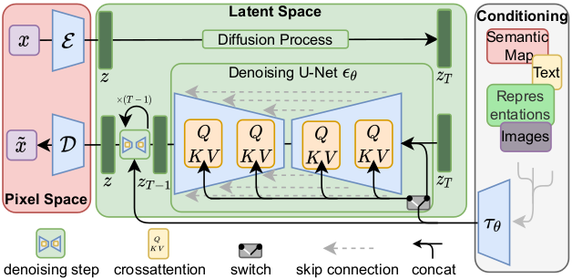

# 3D Latent Diffusion Model (LDM) Implementation

<!-- 
  Project badges provide quick visual overview of:
  - License: MIT (open source, permissive)
  - Python: 3.8+ (minimum version requirement)  
  - PyTorch: 2.0+ (deep learning framework)
  - Docker: Container-ready deployment
  - Kubernetes: Production orchestration support
  - Azure ML: Cloud ML platform integration
-->
[](LICENSE)
[](https://python.org)
[](https://pytorch.org)
[](https://docker.com)
[](https://kubernetes.io)
[](https://azure.microsoft.com/services/machine-learning/)

<!-- 
  Project Description:
  This is a comprehensive implementation designed for medical imaging professionals and ML engineers
  who need production-ready 3D image generation capabilities. The project emphasizes:
  - Medical image synthesis for brain MRI data
  - Enterprise-grade deployment options
  - Multi-GPU training optimization
  - Complete MLOps lifecycle support
-->
A comprehensive, production-ready implementation of 3D Latent Diffusion Models for medical image synthesis, specifically designed for brain MRI data. This project provides end-to-end training and inference pipelines with enterprise-grade MLOps capabilities, multiple deployment options, and comprehensive monitoring.

## 🚀 Features

<!-- 
  Features are organized into three categories:
  1. Core ML Capabilities: The actual AI/ML functionality
  2. Enterprise MLOps: Production deployment and operations
  3. Production Infrastructure: Technical infrastructure support
-->

### Core ML Capabilities
<!-- These features focus on the machine learning aspects -->
- **Complete 3D LDM Pipeline**: Full implementation from autoencoder training to diffusion model inference
- **Multi-GPU Support**: Optimized distributed training with Distributed Data Parallel (DDP)
- **Memory Efficient**: Automatic Mixed Precision (AMP) and gradient checkpointing for large model training
- **Flexible Configurations**: Support for different GPU memory sizes (16GB, 32GB, multi-GPU setups)

### Enterprise MLOps
<!-- These features enable production deployment and monitoring -->
- **Multiple Deployment Options**: Azure ML managed endpoints, Docker containers, and Kubernetes orchestration
- **CI/CD Pipelines**: Automated testing, building, and deployment with GitHub Actions
- **Model Monitoring**: Real-time performance monitoring, data drift detection, and A/B testing capabilities
- **Auto-scaling**: Dynamic scaling based on load with Kubernetes HPA and Azure ML endpoints
- **Security**: RBAC, network policies, secret management, and vulnerability scanning

### Production Infrastructure
<!-- These features provide the technical foundation for enterprise deployment -->
- **Containerization**: Multi-stage Docker builds with CUDA support and security hardening
- **Orchestration**: Complete Kubernetes manifests with persistent storage and monitoring
- **API Gateway**: FastAPI-based REST endpoints with async support and Prometheus metrics
- **Infrastructure as Code**: ARM templates for automated Azure resource provisioning

## 📖 Overview

<!-- 
  Technical Overview:
  The Latent Diffusion Model (LDM) works in two main phases:
  1. Training Phase: Train autoencoder + Train diffusion model in latent space
  2. Inference Phase: Generate noise → Denoise in latent space → Decode to image
  
  Benefits of working in latent space:
  - Reduced computational cost (smaller dimensionality)
  - Better training stability
  - Preserved semantic meaning
-->
The workflow of the Latent Diffusion Model is depicted in the figure below. It begins by training an autoencoder in pixel space to encode images into latent features. Following that, it trains a diffusion model in the latent space to denoise the noisy latent features. During inference, it first generates latent features from random noise by applying multiple denoising steps using the trained diffusion model. Finally, it decodes the denoised latent features into images using the trained autoencoder.

<p align="center">
  
</p>

## 📚 Background

<!-- 
  Academic Foundation:
  This implementation builds upon established research in:
  - Latent diffusion models (Stable Diffusion foundation)
  - Medical imaging applications
  - Brain tumor segmentation datasets
-->
This implementation is based on MONAI's latent diffusion model and follows these key papers:

- **[Latent Diffusion]**: Rombach, Robin, et al. "High-resolution image synthesis with latent diffusion models." CVPR 2022.
- **[Brain Imaging Generation]**: Pinaya et al. "Brain imaging generation with latent diffusion models"
- **[BRATS]**: Menze, Bjoern H., et al. "The multimodal brain tumor image segmentation benchmark (BRATS)."

## 🛠️ Installation

<!--
  Installation Prerequisites:
  - Python 3.8+: Required for modern PyTorch and MONAI features
  - CUDA GPU: Essential for reasonable training times (>16GB VRAM recommended)
  - PyTorch 2.0+: Needed for torch.compile() optimization
  - MONAI: Medical imaging specific deep learning library
-->

### Prerequisites
<!-- 
  Hardware Requirements:
  - CUDA GPU: Training 3D models requires significant GPU memory
  - 16GB+ VRAM: Minimum for basic training with reduced batch sizes
  - 32GB+ VRAM: Recommended for optimal training performance
  - Multi-GPU: Best for large-scale training and faster convergence
-->
- Python 3.8+
- CUDA-capable GPU (recommended: >16GB VRAM)
- PyTorch 2.0+
- MONAI

### Quick Setup
```bash
# Clone the repository
git clone <your-repo-url>
cd 3d_ldm

# Install dependencies - this includes PyTorch, MONAI, and all required packages
pip install -r requirements.txt

# Configure environment - copy template and edit with your specific paths
cp config/environment.json.example config/environment.json
# Edit environment.json with your paths
```

## 📊 Dataset

<!--
  Dataset Information:
  - BraTS: Brain Tumor Segmentation Challenge datasets
  - Medical Decathlon: Standardized medical imaging datasets
  - T1, T2, FLAIR: Different MRI sequence types
  - Important: Always check dataset licensing and usage requirements
-->
The example uses **BraTS 2016 and 2017** data from the [Medical Decathlon](http://medicaldecathlon.com/).

### Download Data
```bash
# This script automatically downloads and preprocesses the BraTS dataset
python download_brats_data.py -e ./config/environment.json
```

**Disclaimer**: We are not the host of the data. Please ensure you read and comply with the dataset's requirements and usage policies.

## 🚀 Quick Start

### 1. Configure Environment
<!--
  Configuration Steps:
  - model_dir: Where trained models will be saved
  - tfevent_path: TensorBoard logging directory
  - output_dir: Generated images and results
  - data_base_dir: Path to your downloaded BraTS dataset
-->
Edit `./config/environment.json`:
```json
{
  "model_dir": "path/to/save/models",
  "tfevent_path": "path/to/tensorboard/logs", 
  "output_dir": "path/to/generated/images",
  "data_base_dir": "path/to/brats/dataset"
}
```

### 2. Train Autoencoder
<!--
  Training Options:
  - Single GPU: Use config_train_32g.json for 32GB GPUs
  - Multi-GPU: Use config_train_multigpu.json for distributed training
  - Memory optimization: Use config_train_16g.json for smaller GPUs
-->
```bash
# Single GPU (32GB) - optimal for single high-memory GPU
python train_autoencoder.py -c ./config/config_train_32g.json -e ./config/environment.json -g 1

# Multi-GPU (Windows) - distributed training across multiple GPUs
train_autoencoder_multigpu.bat 4 config/config_train_multigpu.json true false
```

### 3. Train Diffusion Model
<!--
  Diffusion Training:
  - Requires pre-trained autoencoder from step 2
  - More computationally intensive than autoencoder training
  - Benefits significantly from multi-GPU setups
-->
```bash
# Single GPU - train diffusion model using latent features from autoencoder
python train_diffusion.py -c ./config/config_train_32g.json -e ./config/environment.json -g 1

# Multi-GPU (Linux/Mac) - faster diffusion training with distributed setup
./train_LDM.sh
```

### 4. Generate Images
<!--
  Inference Process:
  - Requires both trained autoencoder and diffusion model
  - --num parameter specifies number of images to generate
  - Generated images saved to output_dir specified in environment.json
-->
```bash
# Generate 5 synthetic brain MRI images
python inference.py -c ./config/config_train_32g.json -e ./config/environment.json --num 5
```

## 💻 Multi-GPU Training

<!--
  Multi-GPU Benefits:
  - Faster training: Linear speedup with number of GPUs
  - Larger batch sizes: Better gradient estimates
  - Memory pooling: Train larger models
  - Production readiness: Scales to enterprise workloads
-->
This implementation includes extensive multi-GPU optimizations:

### Key Features
<!--
  Technical Optimizations:
  - DDP: Distributed Data Parallel for efficient multi-GPU training
  - AMP: Automatic Mixed Precision reduces memory usage
  - Torch Compile: PyTorch 2.0+ performance optimization
  - Sync BN: Synchronized batch normalization across GPUs
  - Gradient Checkpointing: Trade compute for memory efficiency
-->
- **Distributed Data Parallel (DDP)** with static graph optimization
- **Automatic Mixed Precision (AMP)** for memory efficiency
- **Torch Compile** optimization (PyTorch 2.0+)
- **Synchronized Batch Normalization** across GPUs
- **Gradient Checkpointing** for memory reduction

### Usage Examples
```bash
# Windows Multi-GPU - 8 GPUs with full optimizations enabled
train_autoencoder_multigpu.bat 8 config/config_train_multigpu.json true true

# Linux/Mac Multi-GPU - using torchrun for distributed training
export NUM_GPUS_PER_NODE=8
torchrun --nproc_per_node=${NUM_GPUS_PER_NODE} --nnodes=1 \
    train_autoencoder.py -c ./config/config_train_32g.json -e ./config/environment.json -g ${NUM_GPUS_PER_NODE}
```

<!--
  Documentation Reference:
  For comprehensive multi-GPU setup, optimization strategies, and troubleshooting
-->
For detailed multi-GPU setup and optimization, see [README_MULTIGPU.md](./README_MULTIGPU.md).

## 📈 Results

<!--
  Results Visualization:
  - Training curves show model convergence over epochs
  - Reconstruction loss: How well autoencoder preserves input data
  - Diffusion loss: How well diffusion model learns denoising process
  - Generated samples: Quality of synthetic brain MRI images
-->

### Training Performance
<!-- Training curves demonstrate model convergence and learning stability -->
<p align="center">
  
  
</p>

<p align="center">
  
  
</p>

### Generated Samples
<!-- Examples of synthetic brain MRI images in different anatomical views -->
<p align="center">
  
  
  
</p>

## 🚀 Deployment Options

<!--
  Deployment Strategy Overview:
  Multiple deployment options are provided to support different use cases:
  1. Docker: Containerized deployment for consistency and portability
  2. Kubernetes: Production orchestration with scaling and monitoring
  3. Azure ML: Cloud-native deployment with managed infrastructure
  
  Each option has specific advantages:
  - Docker: Local development, testing, simple deployments
  - Kubernetes: Production workloads, auto-scaling, enterprise features
  - Azure ML: Managed service, cost optimization, integrated monitoring
-->
This project supports multiple deployment strategies to meet different production requirements:

### 1. 🐳 Docker Deployment

<!--
  Docker Deployment Benefits:
  - Consistent environment across development and production
  - Easy local testing and development
  - Portable across different infrastructure
  - Supports GPU acceleration for training and inference
-->

#### Quick Start with Docker
```powershell
# Build and run API server for production inference
.\mlops\docker\setup_docker.ps1 -Environment prod -Mode api

# Run training container for model development
.\mlops\docker\setup_docker.ps1 -Environment dev -Mode train

# Launch Jupyter notebook for interactive development
.\mlops\docker\setup_docker.ps1 -Environment dev -Mode jupyter
```

#### Manual Docker Commands
```bash
# Build production image with optimizations
docker build -t 3d-ldm:prod -f mlops/docker/Dockerfile --target production .

# Run API server with GPU support and volume mounts
docker run -d -p 8000:8000 --gpus all --name 3d-ldm-api \
  -v 3d-ldm-models:/app/models \
  -e MODE=api \
  3d-ldm:prod

# Health check - verify API is running
curl http://localhost:8000/health
```

### 2. ☸️ Kubernetes Deployment

<!--
  Kubernetes Benefits:
  - Production-grade orchestration
  - Auto-scaling based on load
  - High availability and fault tolerance
  - Enterprise security features
  - Integrated monitoring and logging
-->

#### Prerequisites
<!--
  Infrastructure Requirements:
  - Kubernetes cluster: Local (minikube/kind) or cloud (AKS/EKS/GKE)
  - kubectl: Command-line tool for cluster management
  - GPU operator: NVIDIA driver management for GPU workloads
-->
- Kubernetes cluster (local or cloud)
- kubectl configured
- NVIDIA GPU operator (for GPU workloads)

#### Deployment Commands
```bash
# Deploy complete application stack with all components
./mlops/kubernetes/setup_kubernetes.sh apply

# Check deployment status and pod health
./mlops/kubernetes/setup_kubernetes.sh status

# View logs from running pods
./mlops/kubernetes/setup_kubernetes.sh logs

# Run comprehensive health checks
./mlops/kubernetes/setup_kubernetes.sh health
```

#### Kubernetes Features
<!--
  Production Features:
  - HPA: Automatically scales pods based on resource utilization
  - PVC: Persistent volumes for model storage and data
  - Prometheus: Metrics collection and alerting
  - RBAC: Role-based access control for security
  - GPU scheduling: Efficient GPU resource allocation
-->
- **Auto-scaling**: Horizontal Pod Autoscaler (HPA) based on CPU/memory
- **Persistent Storage**: PVC for models, data, and outputs
- **Monitoring**: Prometheus metrics and Grafana dashboards
- **Security**: RBAC, network policies, and secret management
- **GPU Support**: Dedicated GPU nodes with taints and tolerations

### 3. ☁️ Azure Machine Learning

<!--
  Azure ML Advantages:
  - Managed infrastructure: No server management
  - Cost optimization: Pay only for compute used
  - Enterprise integration: Seamless with Azure services
  - MLOps features: Built-in experiment tracking and model registry
-->

#### Infrastructure Setup
```powershell
# Deploy complete Azure infrastructure including ML workspace, compute, storage
.\mlops\azure\deploy_azure.ps1 -Environment prod -ResourceGroup "3dldm-prod" -Location "East US"
```

#### Azure ML Features
<!--
  Managed Services:
  - Endpoints: Auto-scaling inference with load balancing
  - Compute: On-demand GPU clusters with spot instance support
  - MLflow: Integrated experiment tracking and model versioning
  - Datasets: Versioned data with lineage and governance
-->
- **Managed Endpoints**: Auto-scaling inference endpoints
- **Compute Clusters**: On-demand GPU clusters for training
- **Experiment Tracking**: MLflow integration with model registry
- **Data Versioning**: Azure ML datasets with lineage tracking
- **Cost Optimization**: Spot instances and automatic shutdown

### 4. 🔄 CI/CD Pipeline

<!--
  CI/CD Pipeline Benefits:
  - Automated quality assurance
  - Consistent deployment process
  - Reduced manual errors
  - Fast feedback loops
  - Multi-environment promotion
-->
The project includes a comprehensive GitHub Actions pipeline:

#### Pipeline Stages
<!--
  Pipeline Flow:
  1. Code Quality: Ensures code standards and security
  2. Testing: Validates functionality and performance
  3. Building: Creates deployable artifacts
  4. Deployment: Promotes through environments
  5. Monitoring: Verifies deployment success
-->
1. **Code Quality**: Linting, formatting, security scanning
2. **Testing**: Unit tests, integration tests, model validation
3. **Building**: Docker image building and vulnerability scanning
4. **Deployment**: Multi-environment deployment (dev → staging → prod)
5. **Monitoring**: Post-deployment health checks and performance monitoring

#### Trigger the Pipeline
```bash
# Push to main branch triggers production deployment pipeline
git push origin main

# Pull requests trigger testing and validation pipeline
git push origin feature/new-model
```

## 📊 Monitoring and Observability

<!--
  Observability Strategy:
  - Application metrics: Model-specific performance indicators
  - System metrics: Infrastructure health and resource usage
  - Business metrics: Usage patterns and error rates
  - Distributed tracing: Request flow across services
-->

### Application Metrics
<!--
  Key Performance Indicators:
  - Inference latency: Response time for image generation
  - Throughput: Images generated per second
  - Accuracy: Model quality metrics
  - Resource utilization: GPU, CPU, memory usage
-->
- **Model Performance**: Inference latency, throughput, accuracy
- **System Health**: CPU, memory, GPU utilization
- **Data Quality**: Input validation, drift detection
- **Error Tracking**: Exception rates, failure patterns

### Monitoring Stack
<!--
  Monitoring Tools:
  - Prometheus: Open-source metrics collection
  - Grafana: Visualization and alerting dashboards
  - Azure Monitor: Cloud-native monitoring for Azure deployments
  - MLflow: ML-specific experiment and model tracking
-->
- **Prometheus**: Metrics collection and alerting
- **Grafana**: Visualization dashboards
- **Azure Monitor**: Cloud-native monitoring (for Azure deployments)
- **MLflow**: Experiment tracking and model versioning

### Access Monitoring
```bash
# Local monitoring (Kubernetes) - access Grafana dashboard
kubectl port-forward -n monitoring svc/grafana 3000:80

# Azure monitoring - get Application Insights connection
az ml workspace show --name <workspace-name> --query "applicationInsights"
```

## 🛡️ Security and Compliance

<!--
  Security Framework:
  - Defense in depth: Multiple layers of security controls
  - Zero trust: Never trust, always verify
  - Compliance ready: Meets enterprise security standards
  - Automated security: Security scanning in CI/CD pipeline
-->

### Security Features
<!--
  Container Security:
  - Non-root execution: Reduces attack surface
  - Read-only filesystems: Prevents runtime modifications
  - Minimal base images: Fewer vulnerabilities
  - Security scanning: Automated vulnerability detection
-->
- **Container Security**: Non-root users, read-only filesystems, minimal base images
- **Network Security**: Network policies, ingress controls, TLS encryption
- **Secrets Management**: Kubernetes secrets, Azure Key Vault integration
- **Vulnerability Scanning**: Automated security scanning in CI/CD pipeline
- **RBAC**: Role-based access control for all resources

### Compliance
<!--
  Compliance Features:
  - Data privacy: GDPR/HIPAA considerations for medical data
  - Audit logging: Complete operational audit trail
  - Backup strategy: Data protection and disaster recovery
  - Multi-region: Geographic redundancy for high availability
-->
- **Data Privacy**: No data persistence in containers by default
- **Audit Logging**: Complete audit trail for all operations
- **Backup Strategy**: Automated model and data backups
- **Disaster Recovery**: Multi-region deployment capabilities
  
  
</p>

### Generated Samples
<p align="center">
  
  
  
</p>

## 📁 Project Structure

<!--
  Directory Organization:
  The project is organized into logical sections:
  - config/: All configuration files for different environments
  - mlops/: Complete MLOps infrastructure and deployment code
  - Core scripts: Training and inference functionality
  - Documentation: Comprehensive guides and troubleshooting
  
  This structure supports both research and production use cases.
-->

```
3d_ldm/
├── config/                      # Configuration files for different environments
│   ├── config_train_16g.json        # 16GB GPU optimized configuration
│   ├── config_train_32g.json        # 32GB GPU optimized configuration
│   ├── config_train_multigpu.json   # Multi-GPU distributed training config
│   ├── config_optimized.json        # Performance optimized settings
│   └── environment.json             # Environment paths and directories
├── mlops/                       # Complete MLOps and deployment infrastructure
│   ├── azure/                   # Azure cloud deployment resources
│   │   ├── workspace_config.yml     # Azure ML workspace configuration
│   │   ├── infrastructure.json      # ARM template for Azure resources
│   │   ├── deploy_azure.ps1         # Automated Azure deployment script
│   │   └── conda_env.yml            # Azure ML environment definition
│   ├── docker/                  # Container deployment and orchestration
│   │   ├── Dockerfile               # Multi-stage Docker build with CUDA
│   │   ├── api_server.py            # FastAPI REST API server
│   │   ├── entrypoint.sh            # Flexible container entry point
│   │   ├── health_check.py          # Container health monitoring
│   │   └── setup_docker.ps1         # Automated Docker setup script
│   ├── kubernetes/              # Kubernetes production orchestration
│   │   ├── deployment.yaml          # Application deployment manifests
│   │   ├── ingress.yaml             # Ingress controller and networking
│   │   ├── jobs.yaml                # Training and batch job definitions
│   │   ├── monitoring.yaml          # Prometheus monitoring setup
│   │   ├── storage.yaml             # Persistent volume configurations
│   │   ├── rbac.yaml                # Security and access permissions
│   │   └── setup_kubernetes.sh      # Kubernetes deployment automation
│   ├── deployment/              # Model deployment and serving
│   │   ├── score.py                 # Azure ML model scoring script
│   │   └── deployment_config.yml    # Deployment environment configuration
│   ├── monitoring/              # Observability and monitoring infrastructure
│   │   ├── model_monitor.py         # Model performance monitoring
│   │   ├── data_drift.py            # Data quality and drift detection
│   │   └── alerting_rules.yml       # Prometheus alerting configurations
│   └── pipelines/               # Automated training and inference pipelines
│       ├── training_pipeline.py     # Azure ML automated training pipeline
│       └── pipeline_config.yml      # Pipeline configuration parameters
├── .github/workflows/           # CI/CD automation and quality gates
│   └── deploy.yml               # GitHub Actions deployment pipeline
├── checkpoints/                 # Model artifacts and trained weights
│   └── autoencoder/             # Saved autoencoder model checkpoints
├── results/                     # Training outputs and experimental results
├── figs/                        # Visualization outputs and documentation figures
├── runs/                        # TensorBoard training logs and metrics
├── train_autoencoder.py         # Autoencoder training script (Phase 1)
├── train_diffusion.py           # Diffusion model training script (Phase 2)
├── inference.py                 # Model inference and image generation
├── utils.py                     # Shared utility functions and helpers
├── requirements.txt             # Python package dependencies
├── .gitignore                   # Git ignore patterns
├── LICENSE                      # License file
└── README.md                    # This file
```

## 🔧 Configuration Guide

<!--
  Configuration Strategy:
  Different configurations are provided for various hardware setups:
  - Memory optimization: Adjust batch size and model parameters
  - Hardware targeting: Specific settings for different GPU configurations  
  - Performance tuning: Balance between speed and memory usage
-->

### Training Configurations

#### For 16GB GPUs
<!--
  16GB Configuration:
  - Reduced model complexity: Fewer channels and attention layers
  - Smaller batch sizes: Memory efficient training
  - Gradient checkpointing: Trade compute for memory
-->
```json
{
  "autoencoder_def": {
    "spatial_dims": 3,
    "in_channels": 1,
    "out_channels": 1,
    "num_res_blocks": 2,
    "num_channels": [256, 512],
    "attention_levels": [false, true],
    "latent_channels": 8,
    "norm_num_groups": 32,
    "norm_eps": 1e-6,
    "with_encoder_nonlocal_attn": false,
    "with_decoder_nonlocal_attn": false
  }
}
```

#### For Multi-GPU Training
<!--
  Multi-GPU Configuration:
  - DDP backend: NCCL for optimal GPU communication
  - Timeout settings: Handle slow network connections
  - Optimizations: AMP, compile, synchronized batch norm
-->
```json
{
  "ddp_backend": "nccl",
  "ddp_timeout_seconds": 18000,
  "amp": true,
  "compile": true,
  "sync_bn": true
}
```

### Environment Configuration
<!--
  Directory Structure:
  - model_dir: Persistent storage for trained models
  - tfevent_path: TensorBoard logging for monitoring
  - output_dir: Generated images and evaluation results
  - data_base_dir: Input dataset location
-->
```json
{
  "model_dir": "./checkpoints",
  "tfevent_path": "./runs", 
  "output_dir": "./results",
  "data_base_dir": "./data/brats"
}
```

## 🐛 Troubleshooting

<!--
  Troubleshooting Philosophy:
  Common issues are categorized by type:
  - Memory issues: GPU memory optimization
  - Training issues: Multi-GPU and distributed training
  - Deployment issues: Container and infrastructure problems
-->

### Common Issues

#### CUDA Out of Memory
<!--
  Memory Optimization Strategies:
  - Reduce batch size: Immediate memory relief
  - Gradient checkpointing: Trade compute for memory
  - Mixed precision: Use FP16 for reduced memory usage
-->
```bash
# Reduce batch size in configuration file
"batch_size": 1

# Enable gradient checkpointing to save memory
"use_checkpointing": true

# Use Automatic Mixed Precision (AMP)
"amp": true
```

#### Multi-GPU Training Issues
<!--
  Multi-GPU Diagnostics:
  - Hardware check: Verify all GPUs are accessible
  - NCCL verification: Ensure communication backend works
  - Environment variables: Debug distributed training
-->
```bash
# Check GPU visibility and memory status
nvidia-smi

# Verify NCCL installation and version
python -c "import torch; print(torch.cuda.nccl.version())"

# Enable debug logging for distributed training
export NCCL_DEBUG=INFO
export NCCL_TIMEOUT=18000
```

#### Docker Issues
<!--
  Container Troubleshooting:
  - GPU access: Verify NVIDIA Docker runtime
  - Container logs: Debug application errors
  - Resource monitoring: Check container resource usage
-->
```bash
# Test NVIDIA Docker runtime and GPU access
docker run --rm --gpus all nvidia/cuda:11.8-base-ubuntu20.04 nvidia-smi

# View container logs for debugging
docker logs 3d-ldm-api

# Monitor container resource usage
docker stats
```

<!--
  Comprehensive Documentation:
  Additional documentation provides detailed guidance for specific use cases
-->
For comprehensive troubleshooting, see [TROUBLESHOOTING.md](./TROUBLESHOOTING.md).

## 📚 Documentation

<!--
  Documentation Ecosystem:
  Each document serves a specific purpose:
  - Multi-GPU Guide: Performance optimization for distributed training
  - Optimization Summary: Technical details of performance improvements
  - NaN Fix Guide: Debugging numerical stability issues
  - Troubleshooting: Comprehensive problem-solving guide
-->
- [Multi-GPU Training Guide](./README_MULTIGPU.md)
- [MLOps Optimization Summary](./MULTI_GPU_OPTIMIZATION_SUMMARY.md)  
- [NaN Fix Guide](./NaN_FIX_GUIDE.md)
- [Troubleshooting Guide](./TROUBLESHOOTING.md)

## 🤝 Contributing

<!--
  Contribution Workflow:
  Standard GitHub flow with emphasis on code quality and testing
  - Feature branches: Isolated development
  - Pull requests: Code review and quality gates
  - Testing: Automated validation before merge
-->
1. Fork the repository
2. Create a feature branch (`git checkout -b feature/new-feature`)
3. Commit your changes (`git commit -am 'Add new feature'`)
4. Push to the branch (`git push origin feature/new-feature`)
5. Create a Pull Request

## 📄 License

<!--
  MIT License:
  Permissive open source license allowing commercial use, modification, and distribution
-->
This project is licensed under the MIT License - see the [LICENSE](LICENSE) file for details.

## 🙏 Acknowledgments

<!--
  Attribution and Recognition:
  Proper credit to foundational work and tools that enabled this project
-->
- **MONAI Team**: For providing the foundational diffusion model implementation
- **Rombach et al.**: For the original Latent Diffusion Model paper
- **BraTS Challenge**: For providing the medical imaging dataset
- **PyTorch Team**: For the excellent deep learning framework

## 📞 Support

<!--
  Support Channels:
  Multiple ways for users to get help and engage with the project
-->
For questions, issues, or contributions:

- 📧 **Email**: [your-email@domain.com]
- 💬 **Issues**: [GitHub Issues](https://github.com/your-repo/issues)
- 📖 **Documentation**: [Project Wiki](https://github.com/your-repo/wiki)
- 🐛 **Bug Reports**: Use the issue template for detailed bug reports

---

<!--
  Call to Action:
  Encourage community engagement and project visibility
-->
<p align="center">
  <strong>⭐ If this project helped you, please give it a star! ⭐</strong>
</p>
│   └── README.md           # MLOps setup guide
├── .github/workflows/       # CI/CD pipelines
├── figs/                    # Result figures
├── train_autoencoder.py     # Autoencoder training
├── train_diffusion.py       # Diffusion model training
├── inference.py             # Image generation
├── utils.py                 # Utility functions
├── visualize_image.py       # Visualization tools
├── 3d_ldm_tutorial.ipynb   # Interactive tutorial
└── docs/                    # Additional documentation
    ├── TROUBLESHOOTING.md   # Common issues and solutions
    ├── MULTI_GPU_OPTIMIZATION_SUMMARY.md
    └── NaN_FIX_GUIDE.md
```

## 🏭 MLOps and Production Deployment

This project includes a complete MLOps pipeline for production deployment:

### Azure ML Integration
- **Automated Training**: Scalable training pipelines on Azure ML compute
- **Model Registry**: Versioned model storage with MLflow integration
- **Experiment Tracking**: Comprehensive experiment logging and comparison
- **Environment Management**: Reproducible training environments

### CI/CD Pipeline
- **GitHub Actions**: Automated testing, training, and deployment
- **Multi-environment**: Staging and production deployment workflows
- **Quality Gates**: Code quality checks and model validation
- **Security Scanning**: Automated security vulnerability detection

### Model Deployment
- **REST API Endpoints**: Scalable inference endpoints with auto-scaling
- **Batch Inference**: Large-scale batch processing capabilities
- **A/B Testing**: Support for multiple model versions in production
- **Edge Deployment**: Options for edge and on-premises deployment

### Monitoring and Observability
- **Performance Monitoring**: Real-time latency, throughput, and error tracking
- **Data Drift Detection**: Automated detection of input data changes
- **Model Health**: Continuous model performance evaluation
- **Alerting**: Automated alerts for anomalies and performance degradation

**🚀 Quick MLOps Setup**: See [mlops/README.md](mlops/README.md) for detailed setup instructions.

## 🔧 Configuration

### GPU Memory Configurations
- **16GB GPU**: Use `config_train_16g.json`
- **32GB GPU**: Use `config_train_32g.json`
- **Multi-GPU**: Use `config_train_multigpu.json`

### Key Parameters
- `batch_size`: Adjust based on GPU memory
- `patch_size`: Must be divisible by 4 (autoencoder) or 16 (diffusion)
- `spacing`: Voxel spacing for resampling [1.0, 1.0, 1.0] for high resolution

## 🐛 Troubleshooting

Common issues and solutions are documented in:
- [TROUBLESHOOTING.md](./TROUBLESHOOTING.md) - General troubleshooting
- [NaN_FIX_GUIDE.md](./NaN_FIX_GUIDE.md) - Handling NaN values during training
- [MULTI_GPU_OPTIMIZATION_SUMMARY.md](./MULTI_GPU_OPTIMIZATION_SUMMARY.md) - Multi-GPU specific issues

## 🤝 Contributing

1. Fork the repository
2. Create a feature branch (`git checkout -b feature/amazing-feature`)
3. Commit your changes (`git commit -m 'Add amazing feature'`)
4. Push to the branch (`git push origin feature/amazing-feature`)
5. Open a Pull Request

## 📄 License

This project is licensed under the MIT License - see the [LICENSE](LICENSE) file for details.

## 🙏 Acknowledgments

- [MONAI Project](https://github.com/Project-MONAI/MONAI) for the excellent medical imaging framework
- [Medical Decathlon](http://medicaldecathlon.com/) for providing the BraTS dataset
- Original authors of the Latent Diffusion Models paper

