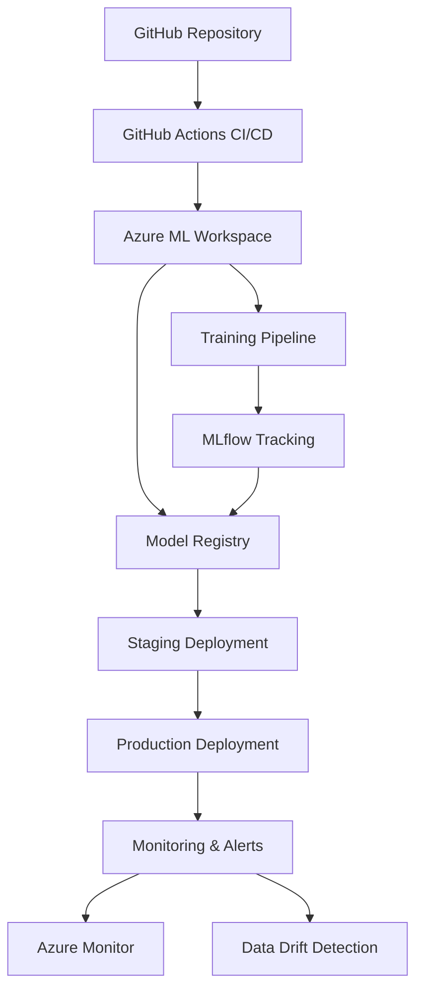

# MLOps Setup Guide for 3D Latent Diffusion Model

This guide provides comprehensive instructions for setting up and deploying the 3D Latent Diffusion Model using Azure Machine Learning and MLOps best practices.

## 🏗️ Architecture Overview



## 📋 Prerequisites

### 1. Azure Resources
- Azure subscription with sufficient quota
- Azure ML workspace
- Azure Storage account
- Azure Container Registry (optional)

### 2. Development Environment
- Python 3.9+
- Git
- Azure CLI
- VS Code (recommended)

### 3. Required Permissions
- Contributor access to Azure subscription
- Machine Learning Contributor role
- Storage Blob Data Contributor role

## 🚀 Quick Start

### Step 1: Azure Setup

1. **Create Resource Group**
```bash
az group create --name rg-3d-ldm-mlops --location eastus
```

2. **Create Azure ML Workspace**
```bash
az ml workspace create --name 3d-ldm-workspace --resource-group rg-3d-ldm-mlops
```

3. **Configure Authentication**
```bash
# Create service principal for GitHub Actions
az ad sp create-for-rbac --name "3d-ldm-sp" --role contributor --scopes /subscriptions/{subscription-id}/resourceGroups/rg-3d-ldm-mlops --sdk-auth
```

### Step 2: GitHub Configuration

1. **Add Repository Secrets**
   - `AZURE_CREDENTIALS`: Output from service principal creation
   - `AZURE_SUBSCRIPTION_ID`: Your Azure subscription ID

2. **Update Configuration**
   - Edit `mlops/azure/workspace_config.yml` with your Azure details
   - Update `subscription_id`, `resource_group`, and `workspace_name`

### Step 3: Initial Setup

1. **Install Dependencies**
```bash
pip install -r requirements.txt
pip install azure-ai-ml azure-identity mlflow
```

2. **Setup Azure ML Workspace**
```bash
cd mlops/azure
python setup_workspace.py
```

3. **Test Connection**
```bash
python -c "from mlops.mlflow_integration import MLflowTracker; tracker = MLflowTracker()"
```

## 🔄 MLOps Workflow

### 1. Training Pipeline

The training pipeline automatically:
- Preprocesses data
- Trains autoencoder and diffusion models
- Logs experiments with MLflow
- Registers models in model registry

**Trigger Training**:
```bash
# Via GitHub Actions (push to main branch)
git push origin main

# Or manually trigger
gh workflow run mlops-pipeline.yml -f deploy_to_production=false
```

### 2. Model Registry

Models are automatically registered with:
- Version tracking
- Performance metrics
- Training metadata
- Model artifacts

**Access Model Registry**:
```python
from mlops.mlflow_integration import ModelRegistry

registry = ModelRegistry("3d-latent-diffusion-model")
latest_model = registry.get_latest_model_version("Production")
```

### 3. Deployment

#### Staging Deployment
Automatically triggered after successful training:
```bash
python mlops/deployment/deploy_model.py --endpoint-name 3d-ldm-staging
```

#### Production Deployment
Requires manual approval or commit message with `[deploy-prod]`:
```bash
# Automatic via GitHub Actions
git commit -m "feat: improve model performance [deploy-prod]"

# Or manual deployment
python mlops/deployment/deploy_model.py --endpoint-name 3d-ldm-production
```

### 4. Monitoring

Comprehensive monitoring includes:
- Performance metrics
- Data drift detection
- Error rate monitoring
- Automated alerts

**Setup Monitoring**:
```python
from mlops.monitoring.model_monitoring import ModelMonitoring

monitor = ModelMonitoring()
monitor.setup_data_drift_monitoring("3d-ldm-production", "baseline_data_v1")
monitor.setup_performance_monitoring("3d-ldm-production")
```

## 📊 Model Usage

### REST API Endpoint

```python
import requests
import json

# Endpoint URL (get from Azure ML Studio)
endpoint_url = "https://3d-ldm-production.eastus.inference.ml.azure.com/score"
headers = {
    "Content-Type": "application/json",
    "Authorization": f"Bearer {api_key}"
}

# Request payload
data = {
    "num_samples": 1,
    "inference_steps": 100,
    "guidance_scale": 7.5,
    "output_format": "nii"
}

# Make request
response = requests.post(endpoint_url, headers=headers, json=data)
result = response.json()
```

### Batch Inference

```bash
# Submit batch job
python mlops/pipelines/azure_ml_pipeline.py --mode batch_inference --num_samples 10
```

## 🔧 Configuration

### Environment Configuration (`mlops/azure/workspace_config.yml`)
```yaml
workspace_name: "3d-ldm-workspace"
resource_group: "rg-3d-ldm-mlops" 
subscription_id: "your-subscription-id"
location: "East US"

compute_targets:
  training_cluster:
    name: "gpu-cluster"
    vm_size: "Standard_NC24ads_A100_v4"
    min_nodes: 0
    max_nodes: 4
```

### Monitoring Configuration (`mlops/monitoring/monitoring_config.json`)
```json
{
  "data_drift_threshold": 0.3,
  "performance_threshold": 0.8,
  "latency_threshold_ms": 10000,
  "error_rate_threshold": 0.05,
  "alert_email": "admin@yourcompany.com"
}
```

## 🔍 Troubleshooting

### Common Issues

1. **Authentication Errors**
```bash
# Re-authenticate with Azure
az login
az account set --subscription "your-subscription-id"
```

2. **Compute Quota Issues**
```bash
# Check quota
az ml compute list-usage --workspace-name 3d-ldm-workspace --resource-group rg-3d-ldm-mlops
```

3. **Model Registration Failures**
```python
# Check MLflow connection
import mlflow
print(mlflow.get_tracking_uri())
```

### Monitoring and Debugging

1. **View Pipeline Logs**
   - Azure ML Studio → Pipelines → Select your run
   - GitHub Actions → Workflow runs

2. **Check Endpoint Health**
```bash
python mlops/deployment/test_endpoint.py --endpoint-name 3d-ldm-production
```

3. **Monitor Performance**
```bash
python mlops/monitoring/model_monitoring.py
```

## 📈 Scaling and Optimization

### Performance Optimization

1. **Model Optimization**
   - Use ONNX format for faster inference
   - Implement model quantization
   - Enable GPU acceleration

2. **Deployment Scaling**
   - Auto-scaling based on load
   - Multi-region deployment
   - Edge deployment options

3. **Cost Optimization**
   - Use spot instances for training
   - Implement compute auto-shutdown
   - Optimize storage costs

### Advanced Features

1. **A/B Testing**
```python
# Deploy multiple model versions
deployer.create_deployment(
    endpoint_name="3d-ldm-production",
    deployment_name="model-v2",
    traffic_percentage=20
)
```

2. **Continuous Training**
```yaml
# Schedule regular retraining
trigger:
  schedule:
    - cron: "0 2 * * 1"  # Weekly on Monday 2 AM
```

3. **Multi-environment Deployment**
```bash
# Deploy to multiple environments
python mlops/deployment/deploy_model.py --environment dev,staging,prod
```

## 🔒 Security Best Practices

1. **Secrets Management**
   - Use Azure Key Vault for sensitive data
   - Rotate service principal credentials regularly
   - Implement least privilege access

2. **Network Security**
   - Use private endpoints for Azure ML
   - Implement VNet integration
   - Enable Azure Firewall

3. **Model Security**
   - Implement model encryption
   - Use secure model serving
   - Monitor for adversarial attacks

## 📚 Additional Resources

- [Azure ML Documentation](https://docs.microsoft.com/en-us/azure/machine-learning/)
- [MLflow Documentation](https://mlflow.org/docs/latest/index.html)
- [GitHub Actions Documentation](https://docs.github.com/en/actions)
- [MONAI Documentation](https://docs.monai.io/)

## 🆘 Support

For issues and questions:
1. Check the [troubleshooting guide](../TROUBLESHOOTING.md)
2. Review Azure ML logs
3. Contact the MLOps team
4. Create an issue in this repository

---

**Next Steps**: After completing this setup, your 3D Latent Diffusion Model will have a complete MLOps pipeline with automated training, deployment, and monitoring capabilities.