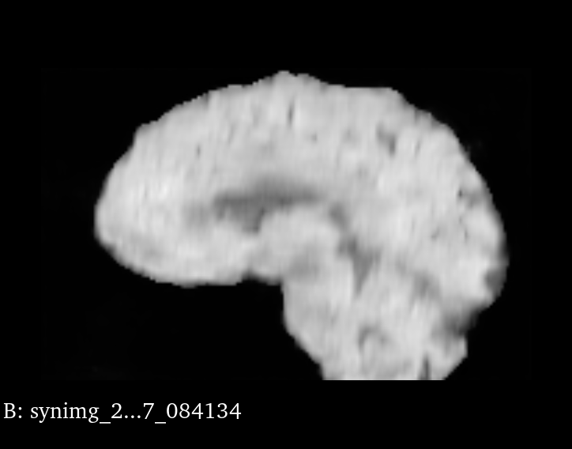
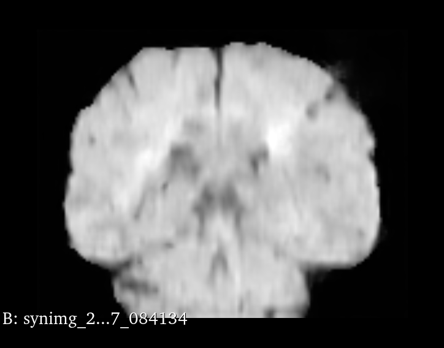

# 3D Latent Diffusion Model (LDM) Implementation

[](LICENSE)
[](https://python.org)
[](https://pytorch.org)

A comprehensive implementation of 3D Latent Diffusion Models for medical image synthesis, specifically designed for brain MRI data. This project provides end-to-end training and inference pipelines with multi-GPU optimization and distributed training support.

## 🚀 Features

- **Complete 3D LDM Pipeline**: Full implementation from autoencoder training to diffusion model inference
- **Multi-GPU Support**: Optimized distributed training with Distributed Data Parallel (DDP)
- **Memory Efficient**: Automatic Mixed Precision (AMP) and gradient checkpointing
- **Flexible Configurations**: Support for different GPU memory sizes (16GB, 32GB, multi-GPU)
- **Comprehensive Documentation**: Detailed guides for setup, training, and troubleshooting
- **Professional Monitoring**: TensorBoard integration and performance profiling

## 📖 Overview

The workflow of the Latent Diffusion Model is depicted in the figure below. It begins by training an autoencoder in pixel space to encode images into latent features. Following that, it trains a diffusion model in the latent space to denoise the noisy latent features. During inference, it first generates latent features from random noise by applying multiple denoising steps using the trained diffusion model. Finally, it decodes the denoised latent features into images using the trained autoencoder.

<p align="center">
  
</p>

## 📚 Background

This implementation is based on MONAI's latent diffusion model and follows these key papers:

- **[Latent Diffusion]**: Rombach, Robin, et al. "High-resolution image synthesis with latent diffusion models." CVPR 2022.
- **[Brain Imaging Generation]**: Pinaya et al. "Brain imaging generation with latent diffusion models"
- **[BRATS]**: Menze, Bjoern H., et al. "The multimodal brain tumor image segmentation benchmark (BRATS)."

## 🛠️ Installation

### Prerequisites
- Python 3.8+
- CUDA-capable GPU (recommended: >16GB VRAM)
- PyTorch 2.0+
- MONAI

### Quick Setup
```bash
# Clone the repository
git clone <your-repo-url>
cd 3d_ldm

# Install dependencies
pip install -r requirements.txt

# Configure environment
cp config/environment.json.example config/environment.json
# Edit environment.json with your paths
```

## 📊 Dataset

The example uses **BraTS 2016 and 2017** data from the [Medical Decathlon](http://medicaldecathlon.com/).

### Download Data
```bash
python download_brats_data.py -e ./config/environment.json
```

**Disclaimer**: We are not the host of the data. Please ensure you read and comply with the dataset's requirements and usage policies.

## 🚀 Quick Start

### 1. Configure Environment
Edit `./config/environment.json`:
```json
{
  "model_dir": "path/to/save/models",
  "tfevent_path": "path/to/tensorboard/logs",
  "output_dir": "path/to/generated/images",
  "data_base_dir": "path/to/brats/dataset"
}
```

### 2. Train Autoencoder
```bash
# Single GPU (32GB)
python train_autoencoder.py -c ./config/config_train_32g.json -e ./config/environment.json -g 1

# Multi-GPU (Windows)
train_autoencoder_multigpu.bat 4 config/config_train_multigpu.json true false
```

### 3. Train Diffusion Model
```bash
# Single GPU
python train_diffusion.py -c ./config/config_train_32g.json -e ./config/environment.json -g 1

# Multi-GPU (Linux/Mac)
./train_LDM.sh
```

### 4. Generate Images
```bash
python inference.py -c ./config/config_train_32g.json -e ./config/environment.json --num 5
```

## 💻 Multi-GPU Training

This implementation includes extensive multi-GPU optimizations:

### Key Features
- **Distributed Data Parallel (DDP)** with static graph optimization
- **Automatic Mixed Precision (AMP)** for memory efficiency
- **Torch Compile** optimization (PyTorch 2.0+)
- **Synchronized Batch Normalization** across GPUs
- **Gradient Checkpointing** for memory reduction

### Usage Examples
```bash
# Windows Multi-GPU
train_autoencoder_multigpu.bat 8 config/config_train_multigpu.json true true

# Linux/Mac Multi-GPU
export NUM_GPUS_PER_NODE=8
torchrun --nproc_per_node=${NUM_GPUS_PER_NODE} --nnodes=1 \
    train_autoencoder.py -c ./config/config_train_32g.json -e ./config/environment.json -g ${NUM_GPUS_PER_NODE}
```

For detailed multi-GPU setup and optimization, see [README_MULTIGPU.md](./README_MULTIGPU.md).

## 📈 Results

### Training Performance
<p align="center">
  
  
</p>

<p align="center">
  
  
</p>

### Generated Samples
<p align="center">
  
  
  
</p>

## 📁 Project Structure

```
3d_ldm/
├── config/                  # Configuration files
│   ├── config_train_16g.json    # 16GB GPU config
│   ├── config_train_32g.json    # 32GB GPU config
│   ├── config_train_multigpu.json  # Multi-GPU config
│   └── environment.json     # Environment paths
├── figs/                    # Result figures
├── train_autoencoder.py     # Autoencoder training
├── train_diffusion.py       # Diffusion model training
├── inference.py             # Image generation
├── utils.py                 # Utility functions
├── visualize_image.py       # Visualization tools
├── 3d_ldm_tutorial.ipynb   # Interactive tutorial
└── docs/                    # Additional documentation
    ├── TROUBLESHOOTING.md   # Common issues and solutions
    ├── MULTI_GPU_OPTIMIZATION_SUMMARY.md
    └── NaN_FIX_GUIDE.md
```

## 🔧 Configuration

### GPU Memory Configurations
- **16GB GPU**: Use `config_train_16g.json`
- **32GB GPU**: Use `config_train_32g.json`
- **Multi-GPU**: Use `config_train_multigpu.json`

### Key Parameters
- `batch_size`: Adjust based on GPU memory
- `patch_size`: Must be divisible by 4 (autoencoder) or 16 (diffusion)
- `spacing`: Voxel spacing for resampling [1.0, 1.0, 1.0] for high resolution

## 🐛 Troubleshooting

Common issues and solutions are documented in:
- [TROUBLESHOOTING.md](./TROUBLESHOOTING.md) - General troubleshooting
- [NaN_FIX_GUIDE.md](./NaN_FIX_GUIDE.md) - Handling NaN values during training
- [MULTI_GPU_OPTIMIZATION_SUMMARY.md](./MULTI_GPU_OPTIMIZATION_SUMMARY.md) - Multi-GPU specific issues

## 🤝 Contributing

1. Fork the repository
2. Create a feature branch (`git checkout -b feature/amazing-feature`)
3. Commit your changes (`git commit -m 'Add amazing feature'`)
4. Push to the branch (`git push origin feature/amazing-feature`)
5. Open a Pull Request

## 📄 License

This project is licensed under the MIT License - see the [LICENSE](LICENSE) file for details.

## 🙏 Acknowledgments

- [MONAI Project](https://github.com/Project-MONAI/MONAI) for the excellent medical imaging framework
- [Medical Decathlon](http://medicaldecathlon.com/) for providing the BraTS dataset
- Original authors of the Latent Diffusion Models paper

